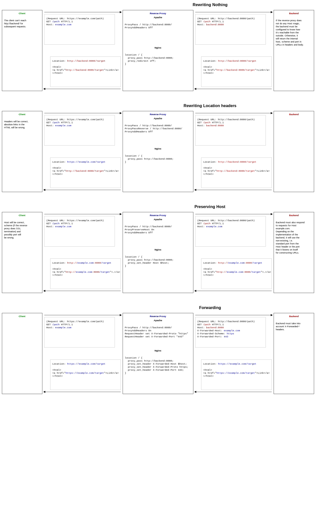
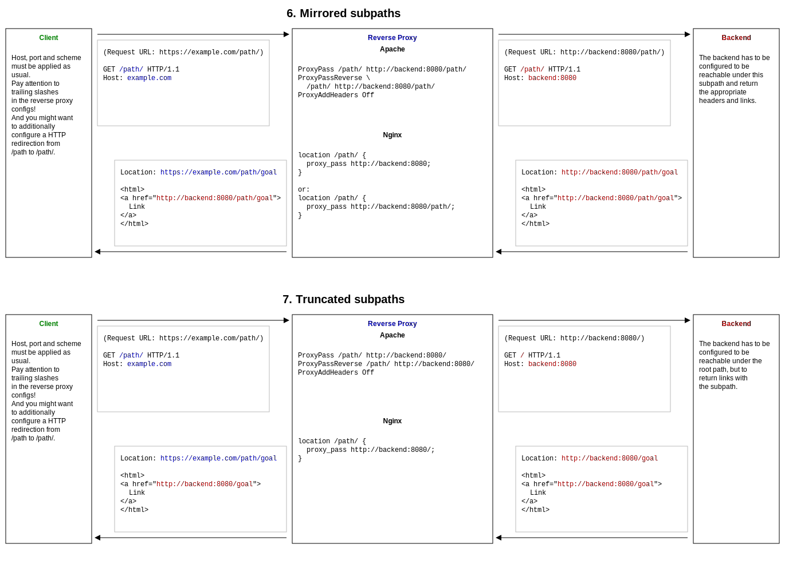

# Reverse Proxy Cheatsheet as a Request-Response Sequence Diagram

Trying to understand what headers and bodies the requests and responses between client, reverse proxy and backend actually contain.

## Getting Host, Port and Scheme right

[View Large Version](https://raw.githubusercontent.com/nubenum/reverse-proxy-cheatsheet-request-response/master/request-response-host-port-scheme.svg?sanitize=true)

[](https://raw.githubusercontent.com/nubenum/reverse-proxy-cheatsheet-request-response/master/request-response-host-port-scheme.svg?sanitize=true)

## Getting Subpaths right

[View Large Version](https://raw.githubusercontent.com/nubenum/reverse-proxy-cheatsheet-request-response/master/request-response-subpath.svg?sanitize=true)

[](https://raw.githubusercontent.com/nubenum/reverse-proxy-cheatsheet-request-response/master/request-response-subpath.svg?sanitize=true)

## Useful cURL Commands

Setting the Host header and being verbose:
```
curl -vH "Host: example.com" http://localhost/
```

To also test HTTPS (using SNI) – an alternative to a local `/etc/hosts` entry:
```
curl -v --resolve example.com:443:127.0.0.1 https://example.com
```