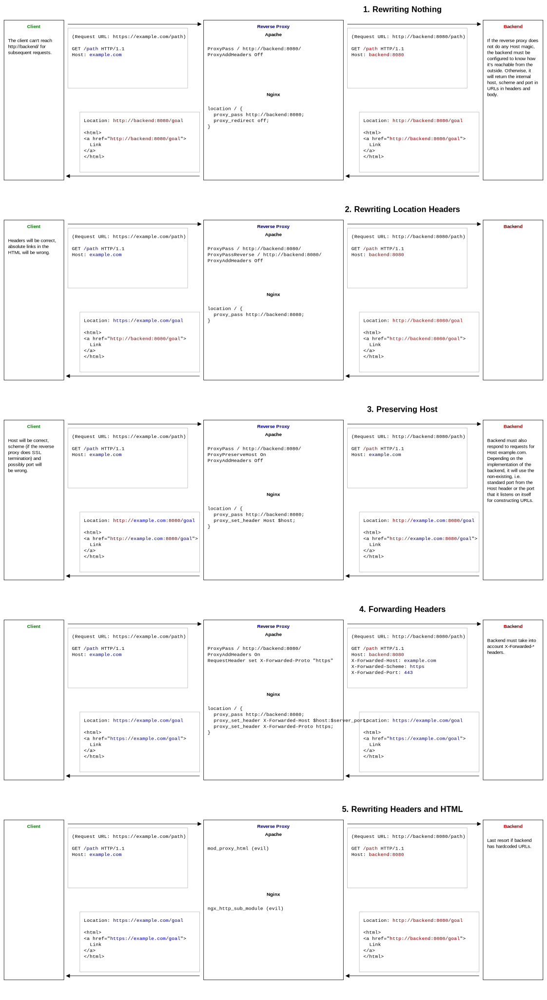

# Reverse Proxy Cheatsheet as a Request-Response Sequence Diagram

Trying to understand, what headers and bodies the requests and responses between client, reverse proxy and backend actually contain.

## Getting Host, Port and Scheme right



## Useful CURL Commands

Setting the Host header and being verbose:
```
curl -vH "Host: example.com" http://localhost/
```

To also test HTTPS (using SNI) – an alternative to a local `/etc/hosts` entry:
```
curl -v --resolve example.com:443:127.0.0.1 https://example.com
```